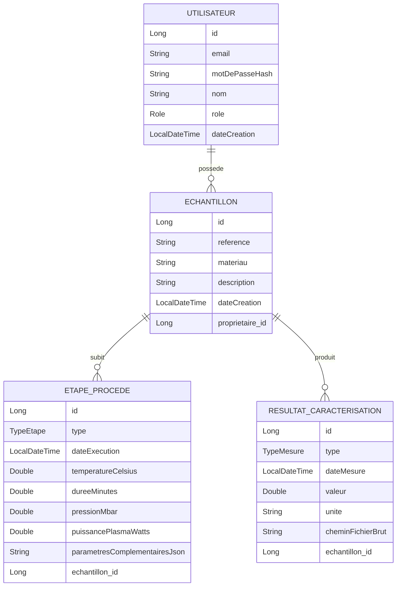

# Modèle de données — Cahier de laboratoire électronique (ELN)

## Schéma relationnel (vue d'ensemble)

## Pourquoi ce découpage

- **Utilisateur → Échantillon (1-N)** : chaque échantillon a un propriétaire, ce qui permet
  de gérer les droits (un TECHNICIEN ne modifie que ses propres échantillons, un CHERCHEUR/ADMIN
  voit tout).
- **Échantillon → Étape de procédé (1-N)** : un échantillon subit plusieurs étapes dans le temps
  (dépôt, gravure, lithographie...). L'ordre chronologique (`dateExecution`) reconstitue
  l'historique complet de fabrication — c'est le cœur de la traçabilité d'un vrai cahier de labo.
- **Échantillon → Résultat de caractérisation (1-N)** : un échantillon peut être mesuré plusieurs
  fois, avec des techniques différentes (épaisseur, FTIR, MEB...).
- **Paramètres en colonnes dédiées + JSON complémentaire** : les paramètres les plus courants
  (température, durée, pression, puissance) sont des colonnes typées pour pouvoir facilement
  filtrer/trier en base ("tous les dépôts à plus de 300°C"). Les paramètres plus spécifiques ou
  rares sont stockés en JSON texte pour rester flexible sans multiplier les colonnes nullables.
## Sécurité et rôles (mis à jour)

L'authentification JWT est maintenant en place (voir README). Le champ `role` de `Utilisateur`
conditionne les droits d'accès côté API :

- **TECHNICIEN** (rôle par défaut à l'inscription) : crée et consulte ses propres échantillons
  uniquement (`POST /api/echantillons`, `GET /api/echantillons/mine`).
- **CHERCHEUR** / **ADMIN** : en plus, peuvent lister tous les échantillons
  (`GET /api/echantillons`) et en supprimer (`DELETE /api/echantillons/{id}`).
  Le mot de passe n'est jamais stocké en clair : `motDePasseHash` contient un hash BCrypt
  (`PasswordEncoder` de Spring Security), généré à l'inscription et vérifié à la connexion.

## Évolutions possibles (V2)

- Remplacer `parametresComplementairesJson` (String) par un vrai type JSONB PostgreSQL avec la
  librairie `hibernate-types`, pour pouvoir requêter dedans directement en SQL.
- Ajouter une entité `Commentaire` (relation N-N Utilisateur ↔ Échantillon) pour la collaboration.
- Ajouter une entité `FichierJoint` générique si vous voulez attacher plusieurs fichiers par
  résultat plutôt qu'un seul chemin.
- Restreindre `GET /api/echantillons/{id}` pour qu'un TECHNICIEN ne puisse consulter que ses
  propres échantillons (actuellement ouvert à tout utilisateur authentifié, à affiner).
## État d'avancement du projet

Fait :
1. Modèle de données JPA (ce document).
2. Repositories Spring Data JPA.
3. DTOs et service métier (`EchantillonService`).
4. Contrôleur REST (`EchantillonController`) avec gestion d'erreurs centralisée.
5. Authentification JWT complète (inscription, connexion, protection par rôle).
   Prochaine étape :
- Front-end (Angular ou React) consommant cette API : formulaire de connexion stockant le
  token, liste des échantillons, formulaire de création avec ajout dynamique d'étapes.
 

